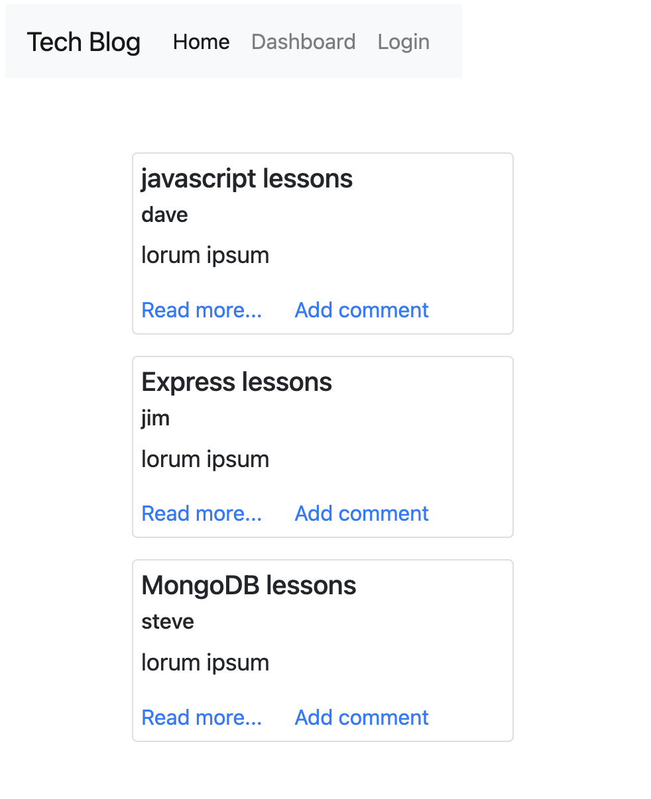

 
# Tech Blog

## Description

A CMS-style blog site similar to a Wordpress site.     
Developers can publish their blog posts and comment on other developers’ posts as well. 
The app uses Handlebars.js, Sequelize and express-session for auth. 

[Link to deployed app](https://tech-blog-nadel-de05ab63c4c8.herokuapp.com/)    

 